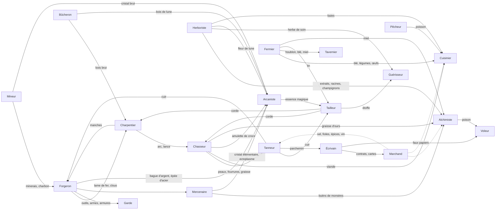

# Métiers

Source : `src/data/jobs.ts` (20 métiers), recettes dans `src/data/recipes.ts`, règles dans `src/game/systems/jobs` et `src/game/actions/jobs`.

## 1. Règles communes

- **Cumulables** : on peut apprendre tous les métiers. Chaque métier appris ajoute le tag `job:<id>` (lu par les PNJ).
- **Niveaux 1..10.** XP pour passer au niveau suivant = **30 × niveau²**.
- **Gain d'XP** (récolte, recette, travail, combat pour chasseur/mercenaire) × (1 + 3 % par point d'INT au-dessus de 5) × 1,10 si humain × (1 + bonus de traits et d'origine du métier).
- **Apprentissage** :
  - `libre` : gratuit, ou automatiquement en pratiquant (première récolte) ;
  - `maitre` : auprès d'un PNJ qui l'enseigne (`teaches`), opinion **non hostile**, coût `learnCost` réduit de **25 %** si le PNJ est **amical** ou allié ;
  - `livre` : en utilisant le livre (effet `unlock: job:<id>`).
  - Quelques métiers libres ont aussi un maître ou un livre (utile pour les apprendre sans pratiquer).
- **Travailler** (`work`) : 4 h, 3 énergie, dans un lieu dont le type est permis ; `or = or/h × 4 × (1 + niveau × 0,1 + (stat − 5) × 0,03) × prospérité / 50`. Exemple : garde niveau 1, FOR 5, au Bourg-du-Gué (prospérité 55) → 3 × 4 × 1,1 × 1,1 ≈ **14 po**. Le garde réduit le danger du lieu ; `reputation: 1` ajoute de la réputation locale.
- **Outils** : pour récolter, il faut **l'un** des outils listés du métier ; pour une recette, **tous** les outils de la recette.

| Niveau → suivant | 1→2 | 2→3 | 3→4 | 4→5 | 5→6 | 6→7 | 7→8 | 8→9 | 9→10 | Total 1→10 |
|---|---|---|---|---|---|---|---|---|---|---|
| XP | 30 | 120 | 270 | 480 | 750 | 1 080 | 1 470 | 1 920 | 2 430 | 8 550 |

Titres de progression : chaque métier a 4 paliers (niveaux 1, 3, 5, 8) avec un titre et ce qu'ils débloquent (voir le détail ci-dessous).

## 2. Tableau des 20 métiers

| Métier (id) | Famille | Stats clés | Outils | Apprentissage | Coût | Maîtres | Travailler (or/h, stat, types de lieu) | Guilde |
|---|---|---|---|---|---|---|---|---|
| **Mineur** (`mineur`) | Récolte | FOR, VIT | Pioche | libre | 0 | Thrain Brisefer | 3, FOR, mine | clan_karak |
| **Bûcheron** (`bucheron`) | Récolte | FOR, VIT | Hache de bûcheron, Hachette | libre | 0 | — | — | — |
| **Fermier** (`fermier`) | Récolte | VIT, PER | Faucille | libre | 0 | — | 2, VIT, ferme/village | — |
| **Herboriste** (`herboriste`) | Récolte | PER, INT | — | libre | 0 | Ilyndra Feuillelune, Nixi Trois-Doigts | — | — |
| **Chasseur** (`chasseur`) | Récolte | PER, AGI | Arc court, Lance de chasse, Couteau à dépecer, Hachette | libre | 0 | — | — | — |
| **Pêcheur** (`pecheur`) | Récolte | PER, CHN | Canne à pêche | libre | 0 | — | — | — |
| **Forgeron** (`forgeron`) | Artisanat | FOR, INT | Marteau de forge | maitre | 30 | Barda Ferrebrune, Grukka Main-de-Fer, Thrain Brisefer | — | clan_karak |
| **Charpentier** (`charpentier`) | Artisanat | AGI, FOR | Marteau de forge | maitre | 20 | Tobbin Copeau | — | — |
| **Tanneur** (`tanneur`) | Artisanat | AGI, VIT | Aiguille et fil | maitre | 20 | Grukka Main-de-Fer | — | — |
| **Tailleur** (`tailleur`) | Artisanat | AGI, CHA | Aiguille et fil | maitre | 20 | Ilyndra Feuillelune | — | — |
| **Cuisinier** (`cuisinier`) | Artisanat | INT, PER | — | maitre | 10 | Mère Pivoine Boncœur | — | — |
| **Alchimiste** (`alchimiste`) | Artisanat | INT, VOL | Mortier et pilon | maitre | 40 | Mirelle Aubépine, Nixi Trois-Doigts | — | — |
| **Arcaniste** (`arcaniste`) | Savoir | VOL, INT | — | livre | 0 | Isaure de Vaelmont | — | — |
| **Guérisseur** (`guerisseur`) | Service | VOL, INT | Aiguille et fil | maitre | 15 | Sœur Maëlis | 4, VOL, temple/village/ville (+1 rép.) | temple_aube |
| **Tavernier** (`tavernier`) | Service | CHA, VIT | — | libre | 0 | Odile la Rousse | 3, CHA, taverne/port (+1 rép.) | — |
| **Marchand** (`marchand`) | Commerce | CHA, PER | Balance de marchand | libre | 0 | Aldric Maréval | 3, CHA, ville/port/route | guilde_marchande |
| **Écrivain** (`ecrivain`) | Savoir | INT, CHA | Plume et encre | maitre | 20 | Sœur Maëlis, Orson de Brèche | 3, INT, ville/chateau/temple | — |
| **Voleur** (`voleur`) | Ombre | DIS, AGI | Crochets de serrurier | maitre | 25 | Sifflet | — | main_grise |
| **Garde** (`garde`) | Combat | FOR, PER | — | maitre | 0 | Hector Valdrin | 3, FOR, village/ville/chateau/port (+1 rép.) | couronne |
| **Mercenaire** (`mercenaire`) | Combat | FOR, AGI | — | maitre | 0 | Varek Gor’Nak | 5, FOR, route/campement | clan_gornak |

Fusions : « mage » + « enchanteur » = **Arcaniste** ; « caravanier » = **Marchand**.

> Note : les métiers Garde, Guérisseur, Marchand et Écrivain listent le type de lieu `ville` dans `work.locationKinds`, mais aucun lieu du Val n'est de type `ville` (Port-Salant est un `port`). Les lieux déclarent aussi leurs `workJobs` ; les deux listes ne concordent pas toujours (voir la fin du document).

## 3. Graphe des dépendances (flux réels des recettes)

Les flèches suivent les matières réellement consommées par les recettes et les butins (pas seulement les champs `dependsOn` / `feeds`, qui sont indicatifs).



Version texte des chaînes principales :

```
Mineur ──► Forgeron ──► (Garde, Mercenaire : armes, armures ; Charpentier : lames, clous ; Arcaniste : bague, épée d’acier)
Bûcheron ──► Charpentier ──► (Forgeron : manches ; Chasseur : arcs, lances)
Chasseur ──► Tanneur ──► (Forgeron, Tailleur : cuir ; Écrivain : parchemin)
Fermier ──► Cuisinier / Tavernier / Tailleur (lin)
Herboriste ──► Alchimiste / Guérisseur / Arcaniste (fleur de lune)
Pêcheur ──► Cuisinier
Mercenaire / Chasseur (butins) ──► Alchimiste, Arcaniste, Tailleur (soie)
Écrivain ──► Marchand (contrats) / Voleur (faux papiers)
Marchand : relie les lieux (sel, fioles, épices, vin s'achètent en boutique)
```

## 4. Détail par métier

### Mineur (`mineur`) — Récolte

Extrait minerais, charbon, pierre et cristaux des montagnes.

- **Actions** : Miner, Prospecter un filon
- **Stats clés** : Force, Vitalité · **Outils** : Pioche
- **Ressources utilisées** : —
- **Produit** : Minerai de fer, Minerai de cuivre, Charbon, Pierre, Minerai d’argent, Cristal brut, Gemme brute, Mithril brut
- **Récolte (lieux)** : Pierre (Route du Sel, diff. 5) ; Minerai de fer (Mines de Karak-Dur, diff. 10) ; Minerai de cuivre (Mines de Karak-Dur, diff. 10) ; Charbon (Mines de Karak-Dur, diff. 5) ; Pierre (Mines de Karak-Dur, diff. 5) ; Minerai d’argent (Mines de Karak-Dur, diff. 40) ; Cristal brut (Mines de Karak-Dur, diff. 45) ; Gemme brute (Mines de Karak-Dur, diff. 60) ; Mithril brut (Mines de Karak-Dur, diff. 80) ; Minerai de fer (Col des Crocs, diff. 15) ; Cristal brut (Col des Crocs, diff. 35) ; Cristal brut (Ruines d’Esteral, diff. 30) ; Pierre (Ruines d’Esteral, diff. 5)
- **Apprendre** : libre · maîtres : Thrain Brisefer (Mines de Karak-Dur)
- **Travailler** : 3 po/h, stat Force, lieux de type mine
- **Progression** : niv. 1 *Piocheur* (Fer, cuivre, charbon) → niv. 3 *Mineur* (Argent) → niv. 5 *Maître de filon* (Cristaux et gemmes) → niv. 8 *Seigneur des profondeurs* (Mithril)
- **Dépend de** : Forgeron · **Alimente** : Forgeron, Arcaniste, Charpentier
- **Risques** : Éboulements ; Créatures des profondeurs ; Épuisement · **Revenus** : Faible à moyen, élevé avec l’argent et le mithril
- **Économie** : Fixe l’offre de métal du Val : trop de minage fait chuter le prix du fer. **Réputation** : Apprécié du clan Karak-Dur.
- **PNJ** : Vendre aux forgerons, contrats avec les nains. **Monde** : Les filons s’épuisent et se régénèrent ; les trolls rôdent près des mines.
- **Guilde** : Clan Karak-Dur

### Bûcheron (`bucheron`) — Récolte

Abat les arbres et fournit le bois du Val.

- **Actions** : Couper du bois
- **Stats clés** : Force, Vitalité · **Outils** : Hache de bûcheron, Hachette
- **Ressources utilisées** : —
- **Produit** : Bois brut, Bois de lune
- **Récolte (lieux)** : Bois brut (Forêt de Sylvebrune, diff. 5) ; Bois de lune (Forêt de Sylvebrune, diff. 45)
- **Apprendre** : libre
- **Progression** : niv. 1 *Coupeur* (Bois brut) → niv. 3 *Bûcheron* (Rendement +1) → niv. 5 *Forestier* (Bois de lune) → niv. 8 *Maître forestier* (Coupe sans malus elfe)
- **Dépend de** : — · **Alimente** : Charpentier, Forgeron
- **Risques** : Loups et araignées ; Colère du Cercle sylvain si surexploitation · **Revenus** : Faible, régulier
- **Économie** : Alimente charpentiers et forges (manches). **Réputation** : Couper du bois de lune déplaît au Cercle sylvain.
- **PNJ** : Vendre au charpentier, contrats de bois. **Monde** : La forêt s’épuise si trop exploitée.

### Fermier (`fermier`) — Récolte

Cultive blé, lin, houblon et légumes, élève poules et vaches.

- **Actions** : Récolter, Travailler aux champs
- **Stats clés** : Vitalité, Perception · **Outils** : Faucille
- **Ressources utilisées** : —
- **Produit** : Blé, Lin, Houblon, Légumes, Œufs, Lait, Miel
- **Récolte (lieux)** : Blé (Ferme des Tillac, diff. 5) ; Lin (Ferme des Tillac, diff. 10) ; Houblon (Ferme des Tillac, diff. 10) ; Légumes (Ferme des Tillac, diff. 5) ; Œufs (Ferme des Tillac, diff. 5) ; Miel (Ferme des Tillac, diff. 25)
- **Apprendre** : libre
- **Travailler** : 2 po/h, stat Vitalité, lieux de type ferme, village
- **Progression** : niv. 1 *Journalier* (Blé, légumes) → niv. 3 *Fermier* (Lin, houblon) → niv. 5 *Propriétaire* (Miel) → niv. 8 *Grand exploitant* (Rendement doublé)
- **Dépend de** : — · **Alimente** : Cuisinier, Tavernier, Tailleur
- **Risques** : Mauvaises récoltes ; Pillards ; Maladies · **Revenus** : Faible mais sûr
- **Économie** : Nourrit les villages ; une disette fait flamber les prix. **Réputation** : Aimé des villageois, ignoré des nobles.
- **PNJ** : Vendre à la taverne, aider les fermiers. **Monde** : Les loups et pillards menacent les fermes.

### Herboriste (`herboriste`) — Récolte

Connaît et cueille les plantes utiles, prépare des extraits.

- **Actions** : Cueillir, Préparer un extrait
- **Stats clés** : Perception, Intelligence · **Outils** : aucun
- **Ressources utilisées** : Herbe de soin
- **Produit** : Herbe de soin, Fleur de lune, Champignon noir, Racine amère, Mandragore, Baies sauvages, Extrait d’herbes
- **Récolte (lieux)** : Herbe de soin (Bourg-du-Gué, diff. 5) ; Baies sauvages (Ferme des Tillac, diff. 5) ; Herbe de soin (Temple de l’Aube, diff. 5) ; Herbe de soin (Forêt de Sylvebrune, diff. 5) ; Fleur de lune (Forêt de Sylvebrune, diff. 35) ; Baies sauvages (Forêt de Sylvebrune, diff. 5) ; Mandragore (Col des Crocs, diff. 50) ; Champignon noir (Marais des Pendus, diff. 10) ; Racine amère (Marais des Pendus, diff. 10) ; Mandragore (Marais des Pendus, diff. 45) ; Herbe de soin (Marais des Pendus, diff. 5)
- **Recettes (1)** : Préparer un extrait (niv. 1)
- **Apprendre** : libre · maîtres : Ilyndra Feuillelune (Forêt de Sylvebrune), Nixi Trois-Doigts (Marais des Pendus) · livre : Traité des herbes
- **Progression** : niv. 1 *Cueilleur* (Herbes communes) → niv. 3 *Herboriste* (Fleur de lune) → niv. 5 *Botaniste* (Mandragore) → niv. 8 *Druide* (Récoltes rares doublées)
- **Dépend de** : — · **Alimente** : Alchimiste, Guérisseur, Cuisinier
- **Risques** : Plantes toxiques ; Marais dangereux · **Revenus** : Faible, élevé avec les plantes rares
- **Économie** : Fournit la base de toutes les potions. **Réputation** : Respecté par le Cercle sylvain et le Temple.
- **PNJ** : Vendre aux alchimistes, soigner les villageois. **Monde** : Les plantes rares poussent dans les lieux dangereux.

### Chasseur (`chasseur`) — Récolte

Traque le gibier et les bêtes sauvages pour leur viande et leurs peaux.

- **Actions** : Chasser, Dépecer, Pister une créature
- **Stats clés** : Perception, Agilité · **Outils** : Arc court, Lance de chasse, Couteau à dépecer, Hachette
- **Ressources utilisées** : —
- **Produit** : Viande crue, Peau animale, Plumes, Bois de cerf, Fourrure de loup, Croc de loup, Amulette de crocs
- **Récolte (lieux)** : Peau animale (Forêt de Sylvebrune, diff. 20) ; Viande crue (Forêt de Sylvebrune, diff. 20) ; Plumes (Forêt de Sylvebrune, diff. 10) ; Viande crue (Campement de Gor’Nak, diff. 15) ; Peau animale (Campement de Gor’Nak, diff. 15)
- **Recettes (1)** : Monter une amulette de crocs (niv. 2)
- **Apprendre** : libre
- **Progression** : niv. 1 *Pisteur* (Petit gibier) → niv. 3 *Chasseur* (Butin +1 sur les bêtes) → niv. 5 *Grand veneur* (Trophées rares) → niv. 8 *Tueur de monstres* (Butin rare sur les monstres)
- **Dépend de** : Charpentier, Forgeron · **Alimente** : Tanneur, Cuisinier, Tailleur, Marchand
- **Risques** : Blessures ; Braconnage mal vu en forêt elfique · **Revenus** : Moyen
- **Économie** : Viande et peaux pour tout le Val. **Réputation** : Protéger les fermes des loups plaît aux villageois.
- **PNJ** : Contrats de chasse, vente au tanneur. **Monde** : Réguler loups et araignées réduit le danger d’un lieu.

### Pêcheur (`pecheur`) — Récolte

Pêche en rivière, au marais ou en mer.

- **Actions** : Pêcher
- **Stats clés** : Perception, Chance · **Outils** : Canne à pêche
- **Ressources utilisées** : —
- **Produit** : Poisson frais, Perle noire
- **Récolte (lieux)** : Poisson frais (Port-Salant, diff. 10) ; Perle noire (Port-Salant, diff. 70) ; Poisson frais (Marais des Pendus, diff. 15)
- **Apprendre** : libre
- **Progression** : niv. 1 *Pêcheur du dimanche* (Poisson) → niv. 3 *Pêcheur* (Rendement +1) → niv. 5 *Loup de mer* (Perles) → niv. 8 *Maître pêcheur* (Perles fréquentes)
- **Dépend de** : Charpentier · **Alimente** : Cuisinier, Tavernier
- **Risques** : Tempêtes ; Créatures du marais · **Revenus** : Faible, parfois jackpot (perle noire)
- **Économie** : Nourriture bon marché du port. **Réputation** : Neutre.
- **PNJ** : Vendre aux tavernes et cuisiniers. **Monde** : Surpêche : le poisson se raréfie.

### Forgeron (`forgeron`) — Artisanat

Fond le minerai et forge outils, armes, armures et bijoux.

- **Actions** : Fondre, Forger, Réparer
- **Stats clés** : Force, Intelligence · **Outils** : Marteau de forge
- **Ressources utilisées** : Minerai de fer, Charbon, Lingot de fer, Lingot d’acier, Manche en bois, Cuir tanné
- **Produit** : Lingot de fer, Lingot d’acier, Lingot d’argent, Lame de fer, Épée de fer, Épée d’acier, Épée d’argent, Hache de guerre, Cotte de mailles, Pioche, Bague d’argent
- **Recettes (18)** : Fondre du fer (niv. 1) ; Fondre du cuivre (niv. 1) ; Fondre de l’argent (niv. 3) ; Forger de l’acier (niv. 3) ; Forger des clous (niv. 1) ; Forger une lame de fer (niv. 1) ; Monter une épée de fer (niv. 2) ; Forger un couteau (niv. 1) ; Forger une pioche (niv. 1) ; Forger une hache de bûcheron (niv. 1) ; Forger une lame d’acier (niv. 3) ; Monter une épée d’acier (niv. 4) ; Forger une hache de guerre (niv. 4) ; Forger une épée d’argent (niv. 5) ; Tresser une cotte de mailles (niv. 5) ; Façonner un anneau de cuivre (niv. 2) ; Façonner une bague d’argent (niv. 4) ; Forger l’armure en écailles de dragon (niv. 8)
- **Apprendre** : maitre (30 po) · maîtres : Barda Ferrebrune (Bourg-du-Gué), Grukka Main-de-Fer (Campement de Gor’Nak), Thrain Brisefer (Mines de Karak-Dur) · livre : Manuel du forgeron
- **Progression** : niv. 1 *Apprenti* (Lingots, lames de fer) → niv. 3 *Forgeron* (Acier, bijoux) → niv. 5 *Maître forgeron* (Armes d’argent, mailles) → niv. 8 *Forgeron légendaire* (Écailles de dragon)
- **Dépend de** : Mineur, Charpentier, Tanneur · **Alimente** : Garde, Mercenaire, Chasseur, Mineur, Marchand
- **Risques** : Brûlures ; Gaspillage de métal · **Revenus** : Moyen à élevé
- **Économie** : Transforme le métal brut en biens à forte valeur. **Réputation** : Les armes vendues aux Crocs Rouges fâchent la Couronne.
- **PNJ** : Commandes des gardes, apprentissage auprès des nains. **Monde** : Nécessite une forge (Karak-Dur, Bourg-du-Gué, Port-Salant).
- **Guilde** : Clan Karak-Dur

### Charpentier (`charpentier`) — Artisanat

Travaille le bois : planches, manches, arcs, meubles, bâtiments.

- **Actions** : Scier, Assembler, Construire
- **Stats clés** : Agilité, Force · **Outils** : Marteau de forge
- **Ressources utilisées** : Bois brut, Bois de lune, Clous, Corde
- **Produit** : Planche, Manche en bois, Arc court, Coffre en bois, Table de chêne, Bâton de marche
- **Recettes (7)** : Scier des planches (niv. 1) ; Tailler des manches (niv. 1) ; Tailler un bâton de marche (niv. 1) ; Fabriquer un arc court (niv. 2) ; Monter une lance de chasse (niv. 2) ; Fabriquer un coffre (niv. 2) ; Fabriquer une table (niv. 3)
- **Apprendre** : maitre (20 po) · maîtres : Tobbin Copeau (Bourg-du-Gué)
- **Progression** : niv. 1 *Apprenti* (Planches, manches) → niv. 3 *Charpentier* (Arcs, meubles) → niv. 5 *Menuisier d’art* (Bois de lune) → niv. 8 *Bâtisseur* (Bâtiments (futur))
- **Dépend de** : Bûcheron, Forgeron · **Alimente** : Forgeron, Chasseur, Marchand, Tavernier
- **Risques** : Coupures ; Chutes · **Revenus** : Moyen
- **Économie** : Meubles et bâtiments : indicateur de prospérité d’un village. **Réputation** : Réparer après une attaque = aide à la ville.
- **PNJ** : Commandes de meubles, réparations. **Monde** : Futur : construire et améliorer des bâtiments.

### Tanneur (`tanneur`) — Artisanat

Traite peaux et fourrures en cuir, confectionne les armures légères.

- **Actions** : Tanner, Coudre une armure
- **Stats clés** : Agilité, Vitalité · **Outils** : Aiguille et fil
- **Ressources utilisées** : Peau animale, Peau d’ours, Fourrure de loup, Sel, Graisse d’ours
- **Produit** : Cuir tanné, Cuir épais, Armure de cuir, Armure de fourrure, Parchemin
- **Recettes (5)** : Tanner du cuir (niv. 1) ; Traiter une peau d’ours (niv. 3) ; Coudre une armure de cuir (niv. 2) ; Coudre une armure de fourrure (niv. 3) ; Préparer du parchemin (niv. 1)
- **Apprendre** : maitre (20 po) · maîtres : Grukka Main-de-Fer (Campement de Gor’Nak)
- **Progression** : niv. 1 *Écorcheur* (Cuir) → niv. 3 *Tanneur* (Armures de cuir) → niv. 5 *Maître tanneur* (Cuir épais, fourrures) → niv. 8 *Artisan des écailles* (Écailles)
- **Dépend de** : Chasseur, Marchand · **Alimente** : Forgeron, Tailleur, Écrivain, Marchand
- **Risques** : Odeurs (charisme temporairement réduit en ville) ; Produits corrosifs · **Revenus** : Moyen
- **Économie** : Relie la chasse à l’équipement. **Réputation** : Neutre.
- **PNJ** : Acheter les peaux aux chasseurs. **Monde** : Dépend de la faune locale.

### Tailleur (`tailleur`) — Artisanat

File, tisse et coud vêtements, capes et soieries.

- **Actions** : Filer, Tisser, Coudre
- **Stats clés** : Agilité, Charisme · **Outils** : Aiguille et fil
- **Ressources utilisées** : Lin, Étoffe, Soie d’araignée, Cuir tanné
- **Produit** : Étoffe, Corde, Vêtements simples, Cape de voyage, Vêtements fins, Soie tissée, Armure de soie d’araignée, Robe d’arcaniste
- **Recettes (8)** : Tisser de l’étoffe (niv. 1) ; Tresser une corde (niv. 1) ; Coudre des vêtements simples (niv. 1) ; Coudre une cape de voyage (niv. 2) ; Tisser la soie d’araignée (niv. 3) ; Coudre des vêtements fins (niv. 4) ; Coudre une robe d’arcaniste (niv. 4) ; Coudre une armure de soie (niv. 5)
- **Apprendre** : maitre (20 po) · maîtres : Ilyndra Feuillelune (Forêt de Sylvebrune)
- **Progression** : niv. 1 *Apprenti* (Étoffe, corde) → niv. 3 *Tailleur* (Capes) → niv. 5 *Couturier* (Soie, vêtements fins) → niv. 8 *Maître soyeux* (Armure de soie)
- **Dépend de** : Fermier, Chasseur, Tanneur · **Alimente** : Marchand, Arcaniste, Charpentier
- **Risques** : Faible · **Revenus** : Moyen, élevé avec la soie
- **Économie** : Vêtements fins = biens de luxe. **Réputation** : Vêtir les nobles ouvre leurs portes.
- **PNJ** : Commandes de nobles. **Monde** : La soie impose de chasser les araignées géantes.

### Cuisinier (`cuisinier`) — Artisanat

Transforme les ingrédients en repas qui rendent énergie et vie.

- **Actions** : Moudre, Cuisiner, Conserver
- **Stats clés** : Intelligence, Perception · **Outils** : aucun
- **Ressources utilisées** : Blé, Farine, Viande crue, Poisson frais, Légumes, Œufs, Baies sauvages, Sel
- **Produit** : Farine, Pain, Ragoût, Poisson grillé, Viande séchée, Ration de voyage, Tarte aux baies, Festin
- **Recettes (8)** : Moudre de la farine (niv. 1) ; Cuire du pain (niv. 1) ; Griller du poisson (niv. 1) ; Sécher de la viande (niv. 1) ; Mijoter un ragoût (niv. 2) ; Préparer des rations (niv. 2) ; Cuire une tarte aux baies (niv. 2) ; Préparer un festin (niv. 5)
- **Apprendre** : maitre (10 po) · maîtres : Mère Pivoine Boncœur (Bourg-du-Gué) · livre : Livre de cuisine halfeline
- **Progression** : niv. 1 *Marmiton* (Pain, grillades) → niv. 3 *Cuisinier* (Ragoût, tartes) → niv. 5 *Chef* (Rations de caravane) → niv. 8 *Grand chef* (Festins)
- **Dépend de** : Fermier, Chasseur, Pêcheur · **Alimente** : Tavernier, Marchand, Mercenaire
- **Risques** : Intoxication des clients (réputation) · **Revenus** : Faible à élevé (festins)
- **Économie** : Ajoute de la valeur à la nourriture brute. **Réputation** : Nourrir les pauvres = générosité.
- **PNJ** : Tavernes, nobles, caravanes. **Monde** : Disettes : la nourriture devient une arme économique.

### Alchimiste (`alchimiste`) — Artisanat

Distille potions, remèdes et poisons.

- **Actions** : Distiller, Concocter
- **Stats clés** : Intelligence, Volonté · **Outils** : Mortier et pilon
- **Ressources utilisées** : Extrait d’herbes, Fiole, Venin d’araignée, Champignon noir, Sang régénérant, Essence maudite
- **Produit** : Potion de soin, Antidote, Potion d’énergie, Poison, Potion de force, Élixir de régénération, Potion noire
- **Recettes (7)** : Distiller une potion de soin (niv. 1) ; Préparer un antidote (niv. 1) ; Préparer une potion d’énergie (niv. 2) ; Concocter un poison (niv. 2) ; Préparer une potion de force (niv. 3) ; Distiller un élixir de régénération (niv. 5) ; Distiller la potion noire (niv. 5)
- **Apprendre** : maitre (40 po) · maîtres : Mirelle Aubépine (Port-Salant), Nixi Trois-Doigts (Marais des Pendus)
- **Progression** : niv. 1 *Apprenti* (Soin, antidote) → niv. 3 *Alchimiste* (Énergie, poison) → niv. 5 *Maître des fioles* (Force) → niv. 8 *Grand alchimiste* (Élixirs, potion noire)
- **Dépend de** : Herboriste, Chasseur, Mercenaire · **Alimente** : Guérisseur, Mercenaire, Voleur, Marchand
- **Risques** : Explosions ; Poisons illégaux · **Revenus** : Élevé
- **Économie** : Potions : produit de forte valeur, très demandé en cas d’épidémie. **Réputation** : Poisons et potion noire : mal vus du Temple et de la Couronne.
- **PNJ** : Temple, guérisseurs, marché noir. **Monde** : Dépend des créatures (venin, sang de troll).

### Arcaniste (`arcaniste`) — Savoir

Mage et enchanteur : taille les cristaux, enchante les objets, canalise la magie.

- **Actions** : Tailler un cristal, Enchanter, Canaliser
- **Stats clés** : Volonté, Intelligence · **Outils** : aucun
- **Ressources utilisées** : Cristal brut, Fleur de lune, Cristal élémentaire, Ectoplasme, Bois de lune
- **Produit** : Cristal taillé, Essence magique, Focus de cristal, Talisman de protection, Anneau enchanté, Lame runique, Pierre de lumière
- **Recettes (8)** : Tailler un cristal (niv. 1) ; Condenser une essence magique (niv. 2) ; Purifier de l’ectoplasme (niv. 2) ; Enchanter une pierre de lumière (niv. 2) ; Assembler un focus de cristal (niv. 3) ; Enchanter un talisman (niv. 3) ; Enchanter un anneau (niv. 5) ; Forger une lame runique (niv. 6)
- **Apprendre** : livre · maîtres : Isaure de Vaelmont (Ruines d’Esteral) · livre : Grimoire élémentaire
- **Progression** : niv. 1 *Novice* (Cristaux taillés) → niv. 3 *Arcaniste* (Talismans, focus) → niv. 5 *Enchanteur* (Anneaux enchantés) → niv. 8 *Archimage* (Lames runiques)
- **Dépend de** : Mineur, Herboriste, Mercenaire, Forgeron · **Alimente** : Mercenaire, Marchand, Garde
- **Risques** : Contrecoups magiques ; Méfiance du Temple · **Revenus** : Très élevé mais coûteux
- **Économie** : Crée les objets les plus chers du Val. **Réputation** : Respecté par la Cour Nocturne, surveillé par le Temple.
- **PNJ** : Mages anciens, vampires érudits. **Monde** : Nécessite un autel (Temple, ruines d’Esteral).

### Guérisseur (`guerisseur`) — Service

Soigne blessés et malades avec bandages, baumes et prières.

- **Actions** : Soigner, Préparer un baume
- **Stats clés** : Volonté, Intelligence · **Outils** : Aiguille et fil
- **Ressources utilisées** : Étoffe, Herbe de soin, Graisse d’ours, Eau bénite
- **Produit** : Bandage, Baume du guérisseur
- **Recettes (2)** : Préparer des bandages (niv. 1) ; Préparer un baume (niv. 2)
- **Apprendre** : maitre (15 po) · maîtres : Sœur Maëlis (Temple de l’Aube)
- **Travailler** : 4 po/h, stat Volonté, lieux de type temple, village, ville, +1 réputation locale
- **Progression** : niv. 1 *Aide-soignant* (Bandages) → niv. 3 *Guérisseur* (Baumes) → niv. 5 *Médecin* (Soins payés double) → niv. 8 *Saint homme* (Guérir les épidémies)
- **Dépend de** : Herboriste, Alchimiste, Tailleur · **Alimente** : Garde, Mercenaire
- **Risques** : Contagion · **Revenus** : Moyen, fort gain de réputation
- **Économie** : Réduit l’impact des épidémies sur la prospérité. **Réputation** : Très forte réputation locale.
- **PNJ** : Soigner les PNJ blessés, le Temple. **Monde** : Événements de maladie.
- **Guilde** : Temple de l’Aube

### Tavernier (`tavernier`) — Service

Sert à boire, brasse la bière, anime la salle et entend toutes les rumeurs.

- **Actions** : Servir, Brasser, Animer (jouer du luth)
- **Stats clés** : Charisme, Vitalité · **Outils** : aucun
- **Ressources utilisées** : Houblon, Blé, Miel, Viande crue, Légumes
- **Produit** : Bière, Hydromel, Ragoût
- **Recettes (2)** : Brasser de la bière (niv. 1) ; Fermenter de l’hydromel (niv. 2)
- **Apprendre** : libre · maîtres : Odile la Rousse (Taverne du Sanglier Borgne)
- **Travailler** : 3 po/h, stat Charisme, lieux de type taverne, port, +1 réputation locale
- **Progression** : niv. 1 *Serveur* (Bière) → niv. 3 *Tavernier* (Hydromel) → niv. 5 *Aubergiste* (Rumeurs gratuites) → niv. 8 *Maître d’auberge* (Posséder une taverne)
- **Dépend de** : Fermier, Cuisinier, Pêcheur · **Alimente** : Marchand
- **Risques** : Bagarres ; Dettes des clients · **Revenus** : Régulier, pourboires selon charisme
- **Économie** : Consomme nourriture et boissons locales. **Réputation** : Connu de tous au village.
- **PNJ** : Toutes les rumeurs passent par la taverne. **Monde** : La prospérité du lieu fixe les pourboires.

### Marchand (`marchand`) — Commerce

Achète là où c’est bon marché, revend là où c’est cher. Caravanier et boutiquier.

- **Actions** : Négocier, Transporter, Tenir une boutique
- **Stats clés** : Charisme, Perception · **Outils** : Balance de marchand
- **Ressources utilisées** : —
- **Produit** : Contrat de commerce
- **Apprendre** : libre · maîtres : Aldric Maréval (Port-Salant)
- **Travailler** : 3 po/h, stat Charisme, lieux de type ville, port, route
- **Progression** : niv. 1 *Colporteur* (Prix -3 %) → niv. 3 *Marchand* (Prix -6 %, boutiques) → niv. 5 *Négociant* (Prix -9 %) → niv. 8 *Prince marchand* (Prix -12 %, influence guilde)
- **Dépend de** : Écrivain · **Alimente** : —
- **Risques** : Pillards sur les routes ; Effondrement des prix · **Revenus** : Variable, potentiellement très élevé
- **Économie** : Équilibre les prix entre les lieux. **Réputation** : Guilde marchande ; les arnaques ruinent la réputation.
- **PNJ** : Tous les boutiquiers. **Monde** : Les routes dangereuses font monter les prix à destination.
- **Guilde** : Guilde marchande de Port-Salant

### Écrivain (`ecrivain`) — Savoir

Rédige contrats, lettres, cartes... et parfois des faux.

- **Actions** : Rédiger, Copier, Cartographier, Falsifier
- **Stats clés** : Intelligence, Charisme · **Outils** : Plume et encre
- **Ressources utilisées** : Parchemin, Peau animale
- **Produit** : Parchemin, Contrat de commerce, Carte du Val de Brume, Lettre de recommandation, Faux papiers
- **Recettes (4)** : Rédiger un contrat de commerce (niv. 1) ; Dessiner une carte du Val (niv. 2) ; Rédiger une lettre de recommandation (niv. 3) ; Falsifier des papiers (niv. 4)
- **Apprendre** : maitre (20 po) · maîtres : Sœur Maëlis (Temple de l’Aube), Orson de Brèche (Château de Valcourt)
- **Travailler** : 3 po/h, stat Intelligence, lieux de type ville, chateau, temple
- **Progression** : niv. 1 *Copiste* (Parchemins, contrats) → niv. 3 *Scribe* (Cartes) → niv. 5 *Écrivain* (Faux papiers) → niv. 8 *Chroniqueur* (Livres (futur))
- **Dépend de** : Tanneur, Chasseur · **Alimente** : Marchand, Voleur
- **Risques** : Faux découverts = prison · **Revenus** : Moyen
- **Économie** : Les contrats sont nécessaires au grand commerce. **Réputation** : Érudit respecté ; faussaire recherché.
- **PNJ** : Nobles, marchands, pègre. **Monde** : Les cartes réduisent les embuscades.

### Voleur (`voleur`) — Ombre

Vol à la tire, cambriolage, recel. Le marché noir est votre royaume.

- **Actions** : Voler un PNJ, Voler une boutique, Receler
- **Stats clés** : Discrétion, Agilité · **Outils** : Crochets de serrurier
- **Ressources utilisées** : —
- **Produit** : —
- **Apprendre** : maitre (25 po) · maîtres : Sifflet (Les Bas-Quais)
- **Progression** : niv. 1 *Chapardeur* (Vol à la tire) → niv. 3 *Voleur* (Vol en boutique +10 %) → niv. 5 *Monte-en-l’air* (Receleurs -prix) → niv. 8 *Maître voleur* (Maître de la Main Grise)
- **Dépend de** : Alchimiste, Écrivain · **Alimente** : Marchand
- **Risques** : Être pris : notoriété, réputation, mémoire des PNJ ; Vengeance · **Revenus** : Élevé et risqué
- **Économie** : Les vols réduisent stocks et prospérité des boutiques. **Réputation** : Main Grise +, Couronne et victimes −.
- **PNJ** : Receleurs, gardes, victimes qui se souviennent. **Monde** : La sécurité d’un lieu augmente après des vols.
- **Guilde** : La Main Grise

### Garde (`garde`) — Combat

Maintient l’ordre, patrouille, protège les habitants.

- **Actions** : Patrouiller, Arrêter, Protéger
- **Stats clés** : Force, Perception · **Outils** : aucun
- **Ressources utilisées** : —
- **Produit** : —
- **Apprendre** : maitre · maîtres : Hector Valdrin (Bourg-du-Gué)
- **Travailler** : 3 po/h, stat Force, lieux de type village, ville, chateau, port, +1 réputation locale
- **Progression** : niv. 1 *Recrue* (Patrouilles) → niv. 3 *Garde* (Solde +) → niv. 5 *Sergent* (Commandement (futur)) → niv. 8 *Capitaine* (Capitaine de la garde)
- **Dépend de** : Forgeron, Tanneur · **Alimente** : —
- **Risques** : Combats ; Rancune des criminels · **Revenus** : Régulier
- **Économie** : Patrouiller réduit le danger et augmente la sécurité. **Réputation** : Couronne +, Main Grise −.
- **PNJ** : Tous les habitants, les criminels. **Monde** : Chaque patrouille réduit le danger du lieu.
- **Guilde** : Couronne de Valcourt

### Mercenaire (`mercenaire`) — Combat

Épée à louer : escortes, chasse aux monstres, protection.

- **Actions** : Escorter, Chasser les monstres, Protéger
- **Stats clés** : Force, Agilité · **Outils** : aucun
- **Ressources utilisées** : —
- **Produit** : Dent d’ogre
- **Apprendre** : maitre · maîtres : Varek Gor’Nak (Campement de Gor’Nak)
- **Travailler** : 5 po/h, stat Force, lieux de type route, campement
- **Progression** : niv. 1 *Lame à louer* (Contrats simples) → niv. 3 *Mercenaire* (Primes de monstres) → niv. 5 *Vétéran* (Escortes de caravanes) → niv. 8 *Légende* (Contrats légendaires)
- **Dépend de** : Forgeron, Alchimiste, Guérisseur · **Alimente** : Alchimiste, Arcaniste, Tanneur
- **Risques** : Mort ; Employeurs douteux · **Revenus** : Élevé
- **Économie** : Sécurise les routes et fournit les ressources de monstres. **Réputation** : Varie selon les contrats et les cibles.
- **PNJ** : Clan Gor’Nak, Guilde marchande. **Monde** : Réduit le danger des routes.
- **Guilde** : Clan Gor’Nak

## 5. Points d'attention dans les données

- `produces` n'est pas toujours aligné sur les recettes : le Tavernier liste `ragout` (recette du Cuisinier), le Marchand `contrat_commerce` et l'Écrivain `parchemin` (recettes de l'Écrivain et du Tanneur), le Fermier `lait` (aucun lieu ne le récolte). Inversement, des recettes produisent des objets absents du `produces` de leur métier (ex. forgeron : `lingot_cuivre`, `clous`, `couteau`, `lame_acier`, `anneau_cuivre`, `armure_ecailles` ; charpentier : `lance_chasse`).
- Les recettes `extrait_herbe` (Herboriste) et `baume` (Guérisseur) exigent un **mortier**, absent des `tools` de ces métiers (sans conséquence pour la récolte, mais trompeur pour l'affichage).
- `workJobs` des lieux vs `work.locationKinds` : Port-Salant liste Écrivain et Guérisseur (type `port` non permis), les Bas-Quais listent Tavernier (type `quartier_pauvre`), les Mines listent Garde (type `mine`). À trancher : quelle liste fait foi.
- Le Bûcheron, le Chasseur et le Pêcheur n'ont ni maître ni livre : ils ne s'apprennent qu'en pratiquant (outil requis).
