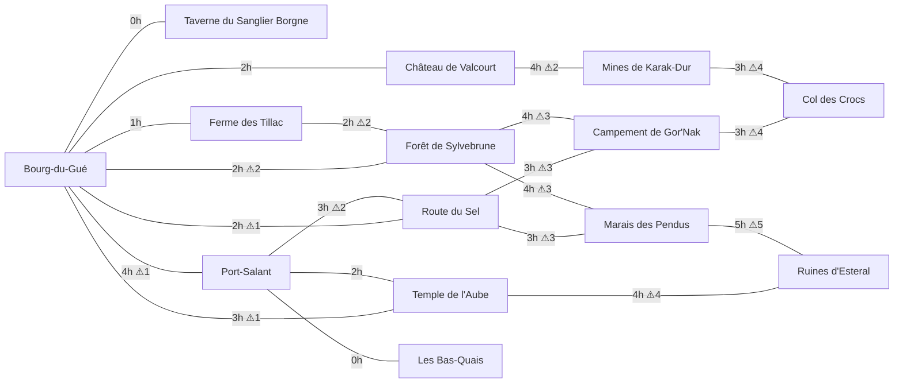

# Le monde : le Val de Brume

Sources : `src/data/locations.ts` (14 lieux, 15 boutiques), `src/data/factions.ts` (10 factions), `src/data/events.ts` (14 événements). Règles d'évolution : `src/game/systems/world`, `worldEvents`, `spawning`.

## 1. Présentation

Une vallée traversée par la rivière Brune, entre les montagnes naines au nord-ouest et la mer à l'est. Au centre, **Bourg-du-Gué**, village de fermiers et d'artisans ; à l'est, **Port-Salant**, la ville marchande, et ses **Bas-Quais** tenus par la Main Grise ; au nord, le **Château de Valcourt** ; à l'ouest, la **forêt elfique de Sylvebrune** ; au sud, la **Route du Sel** infestée de pillards, le **campement orc de Gor'Nak** et le **Marais des Pendus** ; aux confins, les **Mines de Karak-Dur**, le **Col des Crocs** où dort un dragon, et les **Ruines d'Esteral**, empire de mages déchu habité par la Cour Nocturne.

## 2. Carte schématique

Disposition d'après `map.x / map.y` (0..100, nord en haut) ; les liaisons sont dans le graphe et le tableau ci-dessous.

```
            Mines de Karak-Dur                                  Ruines d'Esteral
  Col des Crocs                  Château de Valcourt
                                                     Temple de l'Aube
     Forêt de Sylvebrune
                                   Bourg-du-Gué · Taverne
                  Ferme des Tillac                                Port-Salant
          Campement de Gor'Nak                 Route du Sel              Bas-Quais
                                  Marais des Pendus
```



## 3. Lieux

| Lieu (id) | Type | Parent | Faction | Prosp. | Danger | Sécu. | Pop. | Repos (coût, sûr) | Stations |
|---|---|---|---|---|---|---|---|---|---|
| **Bourg-du-Gué** (`bourg_du_gue`) | village | — | couronne | 55 | 10 | 55 | 320 | 0 po, sûr | forge, cuisine, atelier |
| **Taverne du Sanglier Borgne** (`taverne_du_gue`) | taverne | Bourg-du-Gué | couronne | 50 | 5 | 50 | 30 | 5 po, sûr | cuisine |
| **Ferme des Tillac** (`ferme_tillac`) | ferme | — | couronne | 45 | 15 | 30 | 12 | 0 po, sûr | cuisine |
| **Port-Salant** (`port_salant`) | port | — | guilde_marchande | 70 | 10 | 65 | 2400 | 8 po, sûr | forge, cuisine, laboratoire, atelier, scriptorium, metier_a_tisser, tannerie |
| **Les Bas-Quais** (`bas_quais`) | quartier_pauvre | Port-Salant | main_grise | 20 | 35 | 15 | 600 | 1 po, **non sûr** | tannerie |
| **Temple de l’Aube** (`temple_aube`) | temple | — | temple_aube | 50 | 5 | 60 | 60 | 2 po, sûr | autel, laboratoire, scriptorium |
| **Château de Valcourt** (`chateau_valcourt`) | chateau | — | couronne | 75 | 5 | 85 | 150 | 10 po, sûr | forge, scriptorium |
| **Route du Sel** (`route_du_sel`) | route | — | — | 40 | 35 | 25 | 20 | 3 po, **non sûr** | — |
| **Forêt de Sylvebrune** (`foret_sylvebrune`) | foret | — | cercle_sylvain | 50 | 30 | 20 | 80 | 0 po, **non sûr** | autel |
| **Campement de Gor’Nak** (`camp_gornak`) | campement | — | clan_gornak | 40 | 20 | 50 | 90 | 0 po, sûr | forge, tannerie |
| **Mines de Karak-Dur** (`mines_karak`) | mine | — | clan_karak | 60 | 25 | 60 | 400 | 4 po, sûr | forge, atelier |
| **Col des Crocs** (`col_des_crocs`) | region_dangereuse | — | crocs_rouges | 10 | 70 | 0 | 40 | 0 po, **non sûr** | — |
| **Marais des Pendus** (`marais_pendus`) | marais | — | confrerie_marais | 30 | 45 | 15 | 70 | 2 po, **non sûr** | laboratoire |
| **Ruines d’Esteral** (`ruines_esteral`) | ruine | — | cour_nocturne | 20 | 60 | 10 | 25 | 0 po, **non sûr** | autel, laboratoire |

### Connexions

| De | Vers | Heures | Danger |
|---|---|---|---|
| Bourg-du-Gué | Taverne du Sanglier Borgne | 0 | 0 |
| Bourg-du-Gué | Ferme des Tillac | 1 | 0 |
| Bourg-du-Gué | Port-Salant | 4 | 1 |
| Bourg-du-Gué | Château de Valcourt | 2 | 0 |
| Bourg-du-Gué | Forêt de Sylvebrune | 2 | 2 |
| Bourg-du-Gué | Route du Sel | 2 | 1 |
| Bourg-du-Gué | Temple de l’Aube | 3 | 1 |
| Ferme des Tillac | Forêt de Sylvebrune | 2 | 2 |
| Port-Salant | Les Bas-Quais | 0 | 0 |
| Port-Salant | Route du Sel | 3 | 2 |
| Port-Salant | Temple de l’Aube | 2 | 0 |
| Temple de l’Aube | Ruines d’Esteral | 4 | 4 |
| Château de Valcourt | Mines de Karak-Dur | 4 | 2 |
| Route du Sel | Campement de Gor’Nak | 3 | 3 |
| Route du Sel | Marais des Pendus | 3 | 3 |
| Forêt de Sylvebrune | Campement de Gor’Nak | 4 | 3 |
| Forêt de Sylvebrune | Marais des Pendus | 4 | 3 |
| Campement de Gor’Nak | Col des Crocs | 3 | 4 |
| Mines de Karak-Dur | Col des Crocs | 3 | 4 |
| Marais des Pendus | Ruines d’Esteral | 5 | 5 |

Risque d'embuscade d'un trajet : `danger_connexion × 6 + danger_destination / 5 − DIS × 1,5 − PER − 8 (carte du Val)`, borné 0..60 %. Exemples (DIS 5, PER 5, sans carte) : Bourg → Château 0 % ; Route du Sel → Campement de Gor'Nak ≈ 9,5 % ; Campement → Col des Crocs ≈ 25,5 % ; Marais → Ruines ≈ 29,5 %.

### Détail des lieux

### Bourg-du-Gué (`bourg_du_gue`)

Village de fermiers et d’artisans au bord de la rivière Brune. Une forge fume, le marché sent le pain chaud.

- **Récolte** : Herbe de soin [herboriste] stock 6, +2/j, diff. 5
- **Créatures** : —
- **Boutiques** : Forge de Barda (Barda Ferrebrune) ; Étal de Mère Pivoine (Mère Pivoine Boncœur) — achetable 400 po
- **Produit** : ingredient, aliment · **Demande** : minerai, arme · **Travailler** : fermier, garde, guerisseur
- **PNJ résidents** : Barda Ferrebrune, Mère Pivoine Boncœur, Hector Valdrin, Tobbin Copeau

### Taverne du Sanglier Borgne (`taverne_du_gue`)

Poutres noircies, feu de cheminée et chopes qui s’entrechoquent. Ici, les rumeurs coulent autant que la bière.

- **Récolte** : —
- **Créatures** : —
- **Boutiques** : Comptoir du Sanglier Borgne (Odile la Rousse) — achetable 900 po
- **Produit** : boisson · **Demande** : ingredient, aliment · **Travailler** : tavernier
- **PNJ résidents** : Odile la Rousse

### Ferme des Tillac (`ferme_tillac`)

Champs de blé et de lin, vergers, une grange branlante. Les loups rôdent à la lisière.

- **Récolte** : Blé [fermier] stock 20, +6/j, diff. 5 ; Lin [fermier] stock 12, +4/j, diff. 10 ; Houblon [fermier] stock 10, +3/j, diff. 10 ; Légumes [fermier] stock 14, +4/j, diff. 5 ; Œufs [fermier] stock 6, +3/j, diff. 5 ; Miel [fermier] stock 3, +1/j, diff. 25 ; Baies sauvages [herboriste] stock 8, +3/j, diff. 5
- **Créatures** : Loup gris (poids 3, max 2) ; Cerf (poids 2, max 1)
- **Boutiques** : —
- **Produit** : ingredient, plante · **Demande** : outil · **Travailler** : fermier
- **PNJ résidents** : Jehan Tillac

### Port-Salant (`port_salant`)

Ville portuaire grouillante : quais, entrepôts, guilde marchande, et l’odeur du sel partout.

- **Récolte** : Poisson frais [pecheur] stock 20, +8/j, diff. 10 ; Perle noire [pecheur] stock 1, +0.2/j, diff. 70
- **Créatures** : —
- **Boutiques** : Comptoir de la Guilde (Aldric Maréval) ; Les Fioles de Mirelle (Mirelle Aubépine) ; Poissonnerie du quai — achetable 500 po
- **Produit** : marchandise, aliment · **Demande** : ressource_creature, minerai, bijou, objet_magique · **Travailler** : marchand, tavernier, garde, ecrivain, guerisseur
- **PNJ résidents** : Aldric Maréval, Mirelle Aubépine

### Les Bas-Quais (`bas_quais`)

Ruelles humides sous les entrepôts. Mendiants, contrebandiers et la Main Grise, qui veille sur les siens.

- **Récolte** : —
- **Créatures** : Bandit de grand chemin (poids 1, max 1)
- **Boutiques** : L’arrière-boutique de Sifflet (Sifflet) — receleur
- **Produit** : marchandise · **Demande** : aliment, potion · **Travailler** : tavernier
- **PNJ résidents** : Sifflet

### Temple de l’Aube (`temple_aube`)

Monastère de pierre blanche sur une colline. On y soigne, on y étudie, on y prie la lumière.

- **Récolte** : Herbe de soin [herboriste] stock 10, +3/j, diff. 5
- **Créatures** : —
- **Boutiques** : Apothicairerie du Temple (Sœur Maëlis)
- **Produit** : potion, livre · **Demande** : plante · **Travailler** : guerisseur, ecrivain
- **PNJ résidents** : Sœur Maëlis

### Château de Valcourt (`chateau_valcourt`)

Forteresse du seigneur de Valcourt. Bannières, gardes en armure et intrigues de cour.

- **Récolte** : —
- **Créatures** : —
- **Boutiques** : Intendance du château (Orson de Brèche)
- **Produit** : armure · **Demande** : aliment, boisson, marchandise · **Travailler** : garde, ecrivain
- **PNJ résidents** : Orson de Brèche

### Route du Sel (`route_du_sel`)

Grande route commerciale entre les montagnes et la mer. Relais de caravanes... et repaire de pillards.

- **Récolte** : Pierre [mineur] stock 10, +2/j, diff. 5
- **Créatures** : Bandit de grand chemin (poids 4, max 2) ; Gobelin sauvage (poids 2, max 2) ; Orc pillard (poids 1, max 1) ; Loup gris (poids 2, max 2)
- **Boutiques** : Relais des caravanes (Jorun Barbe-de-Sel) — achetable 700 po
- **Produit** : marchandise · **Demande** : aliment, potion, arme · **Travailler** : mercenaire, marchand
- **PNJ résidents** : Jorun Barbe-de-Sel

### Forêt de Sylvebrune (`foret_sylvebrune`)

Chênes millénaires, clairières de fleurs de lune et chants elfiques. Les loups et les araignées y chassent aussi.

- **Récolte** : Bois brut [bucheron] stock 30, +5/j, diff. 5 ; Bois de lune [bucheron] stock 3, +0.5/j, diff. 45 ; Herbe de soin [herboriste] stock 15, +4/j, diff. 5 ; Fleur de lune [herboriste] stock 4, +1/j, diff. 35 ; Baies sauvages [herboriste] stock 12, +4/j, diff. 5 ; Peau animale [chasseur] stock 8, +2/j, diff. 20 ; Viande crue [chasseur] stock 10, +3/j, diff. 20 ; Plumes [chasseur] stock 10, +3/j, diff. 10
- **Créatures** : Cerf (poids 3, max 2) ; Loup gris (poids 3, max 3) ; Araignée géante (poids 2, max 2) ; Ours brun (poids 1, max 1)
- **Boutiques** : Troc du Cercle (Ilyndra Feuillelune)
- **Produit** : plante, materiau · **Demande** : outil, marchandise · **Travailler** : —
- **PNJ résidents** : Ilyndra Feuillelune

### Campement de Gor’Nak (`camp_gornak`)

Tentes de peaux, feux de camp et totems. Les orcs du clan accueillent quiconque respecte leur code.

- **Récolte** : Viande crue [chasseur] stock 8, +2/j, diff. 15 ; Peau animale [chasseur] stock 6, +2/j, diff. 15
- **Créatures** : Loup gris (poids 1, max 1)
- **Boutiques** : Enclume de Grukka (Grukka Main-de-Fer)
- **Produit** : ressource_animale, armure · **Demande** : boisson, potion, minerai · **Travailler** : mercenaire
- **PNJ résidents** : Grukka Main-de-Fer, Varek Gor’Nak

### Mines de Karak-Dur (`mines_karak`)

Cité naine creusée dans la montagne : galeries, forges géantes, et un troll qui bloque le filon d’argent.

- **Récolte** : Minerai de fer [mineur] stock 25, +6/j, diff. 10 ; Minerai de cuivre [mineur] stock 20, +5/j, diff. 10 ; Charbon [mineur] stock 25, +6/j, diff. 5 ; Pierre [mineur] stock 30, +8/j, diff. 5 ; Minerai d’argent [mineur] stock 6, +1/j, diff. 40 ; Cristal brut [mineur] stock 4, +0.5/j, diff. 45 ; Gemme brute [mineur] stock 2, +0.2/j, diff. 60 ; Mithril brut [mineur] stock 1, +0.05/j, diff. 80
- **Créatures** : Troll des cavernes (poids 1, max 1) ; Élémentaire de pierre (poids 1, max 1)
- **Boutiques** : Halle des Marteaux (Thrain Brisefer)
- **Produit** : minerai, materiau, arme · **Demande** : aliment, boisson, materiau · **Travailler** : mineur, garde
- **PNJ résidents** : Thrain Brisefer

### Col des Crocs (`col_des_crocs`)

Passage montagneux battu par les vents. Repaire des Crocs Rouges, des trolls... et, dit-on, d’un dragon endormi.

- **Récolte** : Minerai de fer [mineur] stock 10, +2/j, diff. 15 ; Cristal brut [mineur] stock 3, +0.5/j, diff. 35 ; Mandragore [herboriste] stock 2, +0.3/j, diff. 50
- **Créatures** : Orc pillard (poids 3, max 2) ; Loup gris (poids 2, max 3) ; Ours brun (poids 1, max 1) ; Ogre (poids 1, max 1) ; Troll des cavernes (poids 1, max 1) ; Élémentaire de pierre (poids 1, max 1)
- **Boutiques** : —
- **Produit** : — · **Demande** : — · **Travailler** : —
- **PNJ résidents** : —

### Marais des Pendus (`marais_pendus`)

Brume verte, pontons pourris et feux follets. La Confrérie gobeline y tient un comptoir étonnamment bien achalandé.

- **Récolte** : Champignon noir [herboriste] stock 10, +3/j, diff. 10 ; Racine amère [herboriste] stock 10, +3/j, diff. 10 ; Mandragore [herboriste] stock 2, +0.4/j, diff. 45 ; Herbe de soin [herboriste] stock 6, +2/j, diff. 5 ; Poisson frais [pecheur] stock 10, +3/j, diff. 15
- **Créatures** : Feu follet (poids 3, max 2) ; Araignée géante (poids 2, max 2) ; Gobelin sauvage (poids 2, max 2) ; Zombie (poids 2, max 2) ; Goule (poids 1, max 1)
- **Boutiques** : Comptoir de Nixi (Nixi Trois-Doigts) — receleur
- **Produit** : plante, ressource_creature · **Demande** : aliment, outil, arme · **Travailler** : —
- **PNJ résidents** : Nixi Trois-Doigts

### Ruines d’Esteral (`ruines_esteral`)

Vestiges d’un empire de mages. Squelettes gardiens, spectres... et, dans une tour intacte, la Cour Nocturne.

- **Récolte** : Cristal brut [mineur] stock 3, +0.5/j, diff. 30 ; Pierre [mineur] stock 15, +3/j, diff. 5
- **Créatures** : Squelette (poids 4, max 3) ; Zombie (poids 2, max 2) ; Spectre (poids 2, max 1) ; Goule (poids 1, max 1) ; Diablotin (poids 1, max 1) ; Strige (poids 1, max 1)
- **Boutiques** : Salon de la Comtesse (Isaure de Vaelmont)
- **Produit** : objet_magique, livre · **Demande** : marchandise, bijou · **Travailler** : —
- **PNJ résidents** : Isaure de Vaelmont, Osric le Veilleur

## 4. Factions

| Faction (id) | Peuples | Valeurs | Lieux | Aime | N’aime pas | Influence |
|---|---|---|---|---|---|---|
| **Couronne de Valcourt** (`couronne`) | humain, halfelin, nain | ordre, loi, tradition | Château de Valcourt, Bourg-du-Gué, Ferme des Tillac | protection, aide_ville, creature_tuee | vol, vol_boutique, menace, attaque_faction | 60 |
| **Guilde marchande de Port-Salant** (`guilde_marchande`) | humain, halfelin, gobelin, nain | profit, contrats, réseau | Port-Salant, Route du Sel | commerce, protection, generosite | vol_boutique, arnaque | 55 |
| **La Main Grise** (`main_grise`) | humain, halfelin, gobelin, elfe | loyauté entre voleurs, discrétion, profit | Les Bas-Quais | vol, vol_boutique, generosite | trahison, protection | 35 |
| **Clan Karak-Dur** (`clan_karak`) | nain | travail, parole donnée, ancêtres | Mines de Karak-Dur | commerce, creature_tuee, aide | arnaque, trahison, vol | 45 |
| **Cercle de Sylvebrune** (`cercle_sylvain`) | elfe, homme_bete, esprit | équilibre, mémoire, nature | Forêt de Sylvebrune | creature_protegee, aide | creature_tuee, attaque_faction | 40 |
| **Clan Gor’Nak** (`clan_gornak`) | orc, homme_bete, gobelin | honneur, force, hospitalité | Campement de Gor’Nak | protection, creature_tuee, aide | trahison, menace, arnaque | 35 |
| **Les Crocs Rouges** (`crocs_rouges`) | orc, humain, gobelin | butin, peur | Col des Crocs, Route du Sel | vol, menace | protection, creature_tuee | 30 |
| **Temple de l’Aube** (`temple_aube`) | humain, halfelin, elfe | charité, lumière, pureté | Temple de l’Aube | aide, generosite, sauvetage | vol, insulte | 40 |
| **Cour Nocturne** (`cour_nocturne`) | vampire, revenant, ancien | savoir, pouvoir, étiquette | Ruines d’Esteral | commerce, generosite | insulte, attaque_faction | 25 |
| **Confrérie des Marais** (`confrerie_marais`) | gobelin, homme_bete | survie, troc, secret | Marais des Pendus | commerce, generosite | insulte, menace | 25 |

### Relations entre factions (−100 guerre … 100 alliance)

| Faction | Relations |
|---|---|
| Couronne de Valcourt | guilde_marchande +40, temple_aube +30, main_grise -70, crocs_rouges -90, clan_gornak -10, cour_nocturne -30 |
| Guilde marchande de Port-Salant | couronne +40, main_grise -40, crocs_rouges -60, clan_karak +30, confrerie_marais +10 |
| La Main Grise | couronne -70, guilde_marchande -40, confrerie_marais +20 |
| Clan Karak-Dur | guilde_marchande +30, couronne +20, clan_gornak -30, crocs_rouges -50 |
| Cercle de Sylvebrune | couronne 0, temple_aube +20, clan_gornak +10, cour_nocturne -40 |
| Clan Gor’Nak | crocs_rouges -80, couronne -10, clan_karak -30, cercle_sylvain +10 |
| Les Crocs Rouges | couronne -90, guilde_marchande -60, clan_gornak -80 |
| Temple de l’Aube | couronne +30, cour_nocturne -70, cercle_sylvain +20 |
| Cour Nocturne | temple_aube -70, couronne -30, cercle_sylvain -40, guilde_marchande 0 |
| Confrérie des Marais | main_grise +20, guilde_marchande +10, couronne -20 |

Axes de conflit :

- **Ordre contre crime** : Couronne (−70) et Guilde (−40) contre la Main Grise ; Couronne contre Crocs Rouges (−90).
- **Honneur orc** : clan Gor'Nak contre Crocs Rouges (−80) ; méfiance avec Karak-Dur (−30).
- **Lumière contre nuit** : Temple de l'Aube contre Cour Nocturne (−70) ; Cercle sylvain méfiant envers la Cour (−40).
- **Économie** : Guilde alliée à la Couronne (+40) et à Karak-Dur (+30), tolérante avec la Confrérie des Marais (+10).

Ce qu'une faction aime ou déteste (`likes` / `dislikes`) correspond aux **types de souvenirs** produits par les actions du joueur (voir [REPUTATION.md](REPUTATION.md)).

## 5. Évolution du monde (tick quotidien)

| Élément | Règle |
|---|---|
| Ressources | `+ regenPerDay` par jour (valeurs fractionnaires possibles : mithril +0,05/j). |
| Prospérité | `+= (sécurité − danger) / 20` par jour. |
| Danger | Tend vers `base.danger + 3 × créatures présentes` ; −2 à chaque créature vaincue ; le travail de garde le réduit. |
| Créatures | Apparition `p = 0,15 + danger / 200`, selon `creatureSpawns` (poids, max). Col des Crocs (danger 70) : 50 %/jour. |
| Influence des factions | Évolue selon la prospérité de leurs `homeLocations` et les effets `faction_influence`. |
| PNJ | Se déplacent selon leurs habitudes, changent d'humeur, commèrent. |
| Boutiques | Réassort selon rareté et prospérité, or reconstitué. |
| Prix | Indices locaux ramenés vers 1. |

Le monde **sans joueur** évolue déjà : la Route du Sel (sécurité 25, danger 35) s'appauvrit lentement, le Château (85/5) prospère, le Col reste invivable. Le joueur fait pencher la balance (patrouilles, chasse, vols, commerce).

## 6. Événements du monde

Chaque jour : les événements expirés appliquent leurs `endEffects`, puis ≈ **45 %** de chance qu'un nouvel événement soit tiré, pondéré par `weight`, parmi ceux dont les `conditions` sont remplies. Chaque événement diffuse une **rumeur**.

| Événement (id) | Poids | Durée (j) | Conditions | Effets | Effets de fin |
|---|---|---|---|---|---|
| **Raid des Crocs Rouges** (`raid_crocs_rouges`) | 3 | 3 | — | danger Route du Sel +20 ; prosperity Route du Sel -8 ; 2× Bandit de grand chemin (Route du Sel) ; prix Port-Salant marchandise ×1.25 ; influence crocs_rouges +5 | danger Route du Sel -12 |
| **Meute affamée** (`meute_affamee`) | 3 | 3 | — | 2× Loup gris (Ferme des Tillac) ; danger Ferme des Tillac +15 ; prix Bourg-du-Gué Viande crue/Œufs/Lait ×1.3 | danger Ferme des Tillac -10 |
| **Belle récolte** (`bonne_recolte`) | 2 | 4 | — | Blé Ferme des Tillac +20 ; prix partout ingredient/aliment ×0.8 ; prosperity Bourg-du-Gué +5 | — |
| **Disette** (`disette`) | 1 | 5 | jour ≥ 5 | Blé Ferme des Tillac -15 ; prix partout ingredient/aliment ×1.6 ; prosperity Bourg-du-Gué -8 | — |
| **Le troll du filon** (`troll_mines`) | 2 | 4 | — | 1× Troll des cavernes (Mines de Karak-Dur) ; Minerai d’argent Mines de Karak-Dur -4 ; prix partout minerai ×1.3 ; prix partout Lingot de fer/Lingot d’acier/Épée de fer/Épée d’acier ×1.2 | — |
| **Grande foire de Port-Salant** (`foire_port`) | 2 | 3 | — | prix Port-Salant bijou/objet_magique/ressource_creature ×1.3 ; prosperity Port-Salant +5 ; influence guilde_marchande +3 | — |
| **Fièvre des marais** (`fievre_marais`) | 1 | 5 | jour ≥ 3 | prosperity Les Bas-Quais -10 ; prix partout Potion de soin/Antidote/Baume du guérisseur/Herbe de soin/Racine amère ×1.8 | — |
| **Nuit des morts** (`nuit_des_morts`) | 2 | 2 | — | 2× Squelette (Ruines d’Esteral) ; 2× Zombie (Marais des Pendus) ; danger Marais des Pendus +10 ; prix partout Eau bénite/Pierre de lumière ×1.5 | danger Marais des Pendus -10 |
| **Migration des araignées** (`araignees_migrent`) | 2 | 4 | — | 2× Araignée géante (Forêt de Sylvebrune) ; danger Forêt de Sylvebrune +10 ; prix partout Soie d’araignée/Venin d’araignée ×0.8 | danger Forêt de Sylvebrune -8 |
| **Grande patrouille** (`patrouille_couronne`) | 2 | 3 | — | danger Route du Sel -15 ; security Route du Sel +15 ; influence couronne +3 ; influence crocs_rouges -4 | security Route du Sel -10 |
| **Arrivée d’un navire d’épices** (`arrivee_epices`) | 2 | 3 | — | prix Port-Salant Épices/Parfum/Vin ×0.7 ; prix Bourg-du-Gué Épices ×1.3 | — |
| **Le Wyrm s’agite** (`reveil_dragon`) | 0.3 | 5 | jour ≥ 10 | 1× Vharox, Wyrm des Cols (Col des Crocs) ; danger Col des Crocs +25 ; danger Mines de Karak-Dur +15 ; prosperity Mines de Karak-Dur -10 ; prix partout minerai/arme/armure ×1.4 | danger Col des Crocs -15 ; danger Mines de Karak-Dur -10 |
| **Jour de marché prospère** (`prosperite_bourg`) | 2 | 2 | prosp. Bourg-du-Gué > 50 | prosperity Bourg-du-Gué +3 ; prix Bourg-du-Gué arme/outil/marchandise ×1.15 | — |
| **Misère aux Bas-Quais** (`exode_bas_quais`) | 1 | 4 | prosp. Les Bas-Quais < 20 | danger Les Bas-Quais +10 ; influence main_grise +4 ; 1× Bandit de grand chemin (Les Bas-Quais) | — |

Idées **Futur** : invasion de gobelins sauvages, fête du Temple, tournoi au château, succession du seigneur malade (rumeur du Bailli), épidémie de la fièvre guérie par le joueur, guerre ouverte Gor'Nak / Crocs Rouges.
